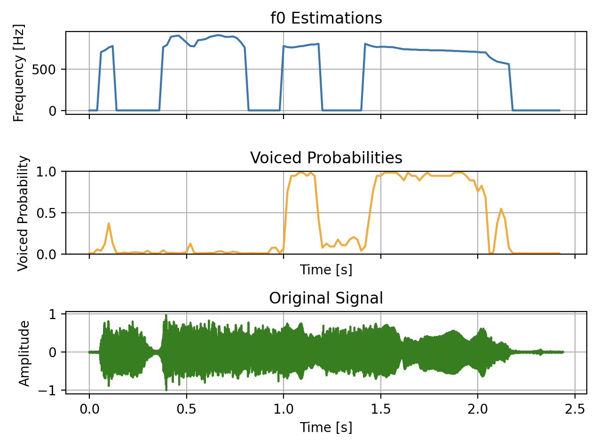
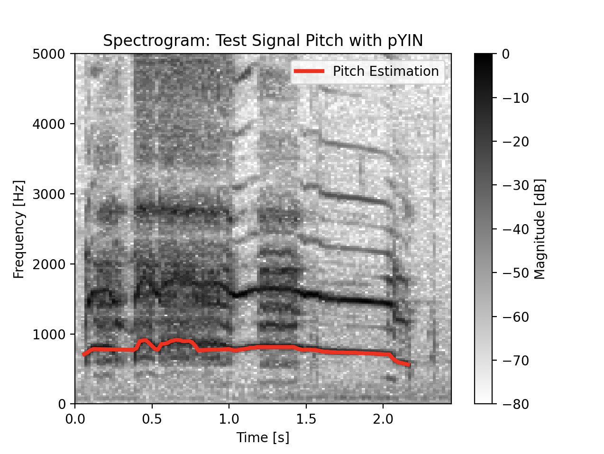
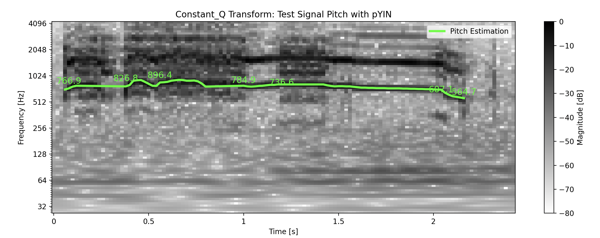
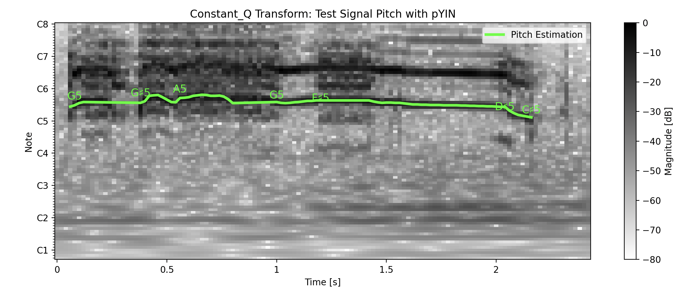

# Pitch detection with pYIN

## Introduction to pYIN pitch detection algorithm

PYIN (Probabilistic YIN) algorithm was proposed by Matthias Mauch and Simon Dixon (2014) in their article ”PYIN: A
fundamental frequency estimator using probabilistic threshold distributions”. Mauch and Dixon introduce
several improvements to classic YIN to make the pitch detection algorithm more robust to octave errors and sudden
jumps. Both PYIN and YIN are based on autocorrelation.

## Example results from the program run

### Rooster crow

#### Pitches in time-domain

#### Pitches in spectrogram

#### Pitches in CQT with frequencies

#### Pitches in CQT with note names

#### Pitches audio output as synthesized sine waves
[Pitches audio output](pitches_pyin.wav)

## Implementation

[Implementation](https://github.com/KooEeVee/audio-signal-processing/blob/main/implementation.md)

## Sources and references
- [GUZHENG - instrument- Single Note - Sound by nanliu_music License: Creative Commons 0](https://freesound.org/s/847157/)
- [Acoustic Piano C4 forte by nanliu_music License: Attribution NonCommercial 4.0](https://freesound.org/s/847227/)
- [20070812.rooster.wav by dobroide License: Attribution 4.0](https://freesound.org/s/39923/)
