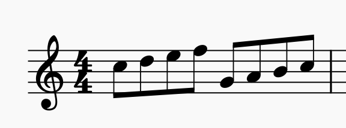
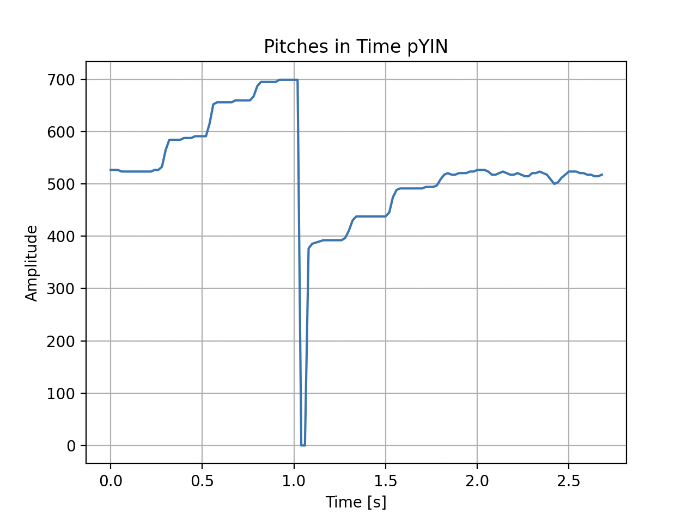
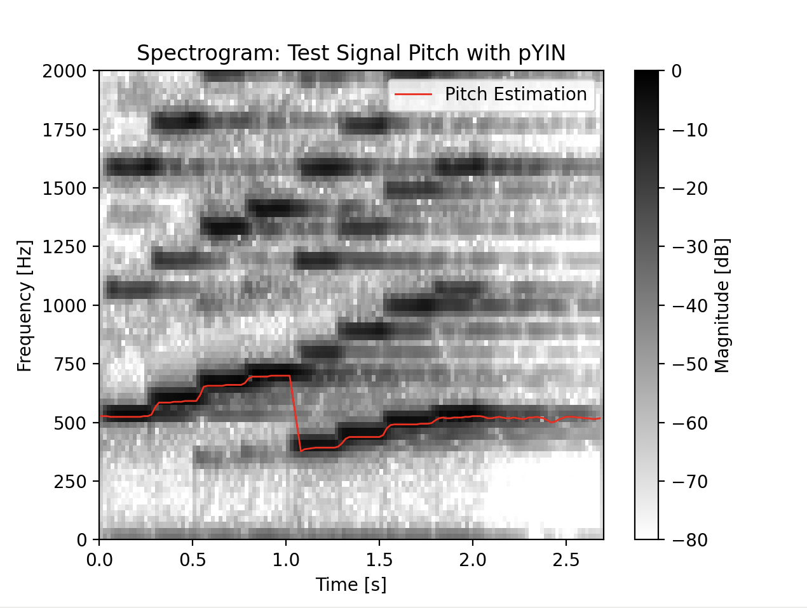
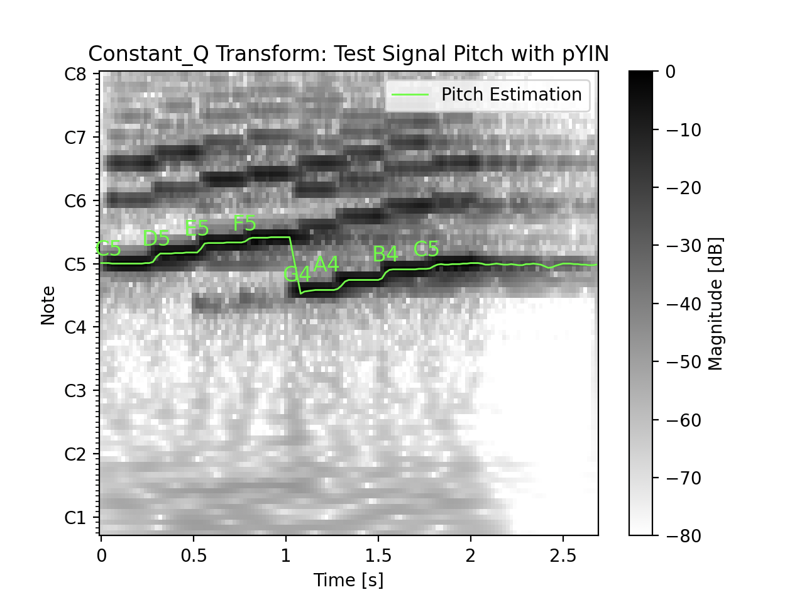
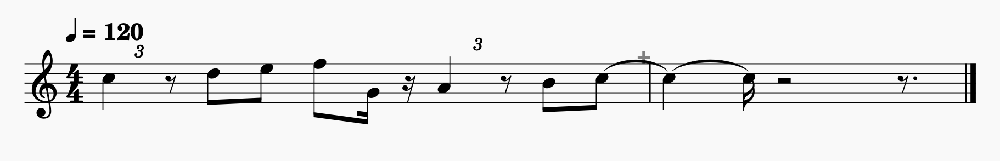
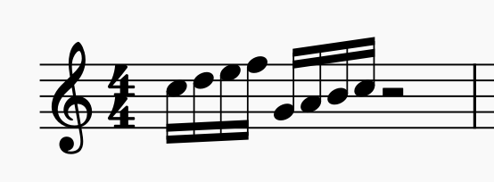
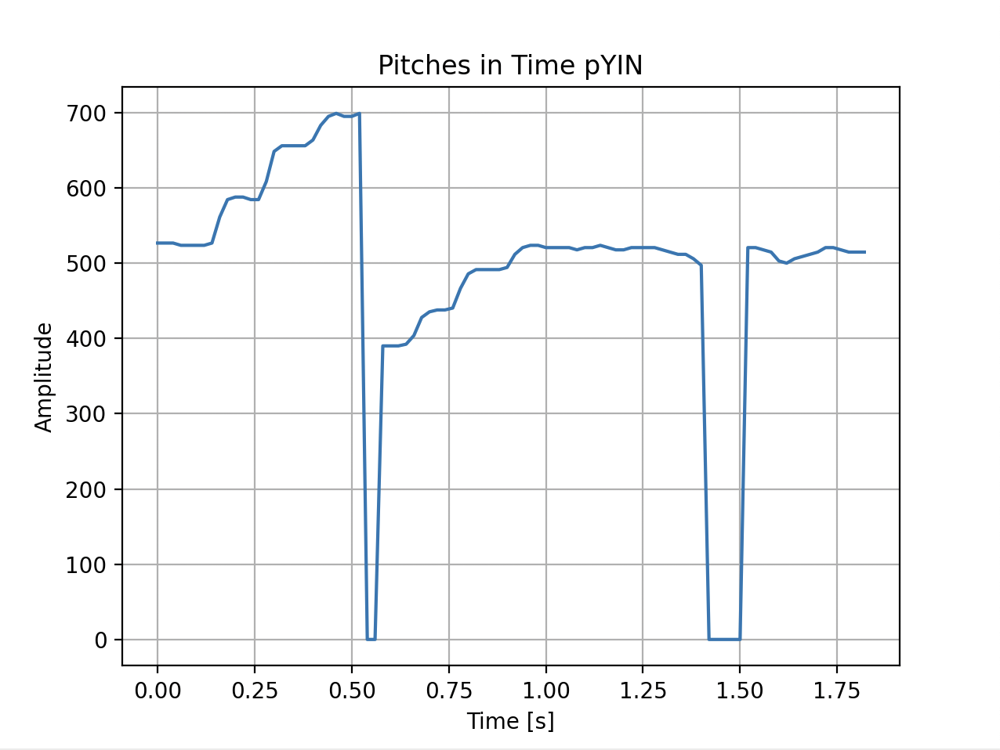
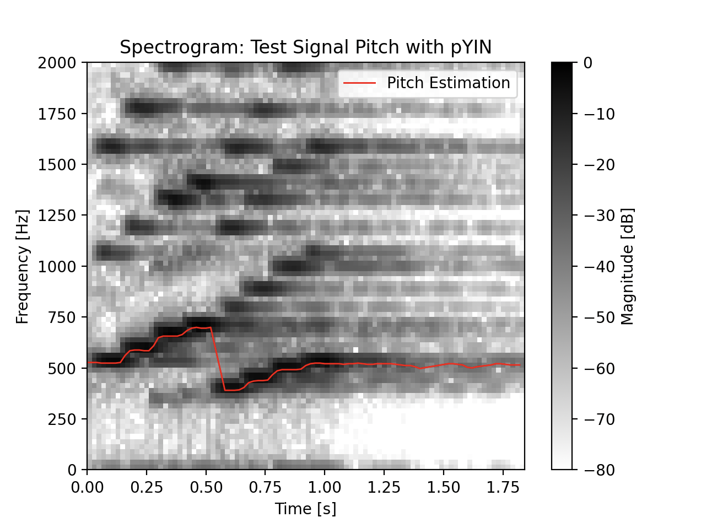
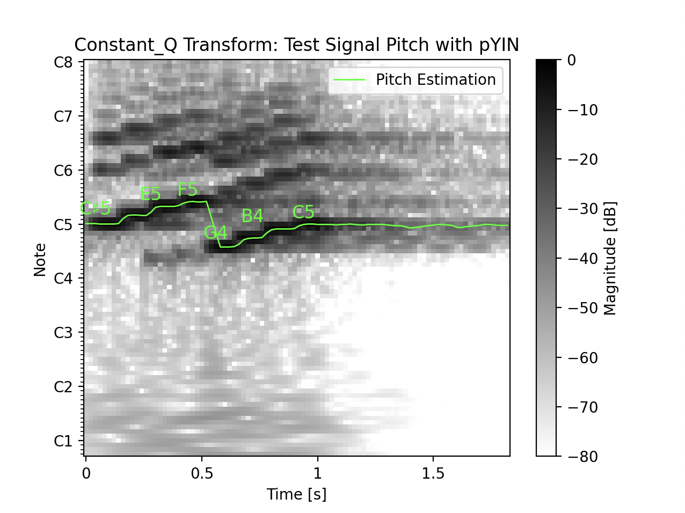
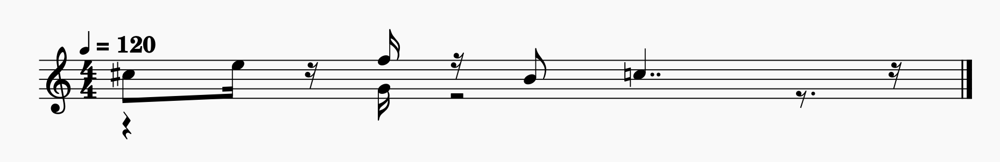

# Pitch detection with pYIN

## Introduction to pYIN algorithm

WIP

## Example results from the program runs

### Flute melody
Comparing synthesized flute notes pitch detection. The first example is eighth note duration and the second is sixteenth note duration. The algorithm detects both melodies well, which can be observed from the time-domain and spectrogram plots. However, the CQT plot and score transcription reveal notable timing problems when comparing the original score to the transcription based on detected pitches.

#### Flute 1/8 notes - original score

#### Flute 1/8 notes - pitches in time-domain

#### Flute 1/8 notes - spectrogram

#### Flute 1/8 notes - CQT

#### Flute 1/8 notes - transcription

#### Flute 1/16 notes - original score

#### Flute 1/16 notes - pitches in time-domain

#### Flute 1/16 notes - spectrogram

#### Flute 1/16 notes - CQT

#### Flute 1/16 notes - transcription

## Sources and references
- [GUZHENG - instrument- Single Note - Sound by nanliu_music License: Creative Commons 0](https://freesound.org/s/847157/)
- [Acoustic Piano C4 forte by nanliu_music License: Attribution NonCommercial 4.0](https://freesound.org/s/847227/)
- [20070812.rooster.wav by dobroide License: Attribution 4.0](https://freesound.org/s/39923/)
